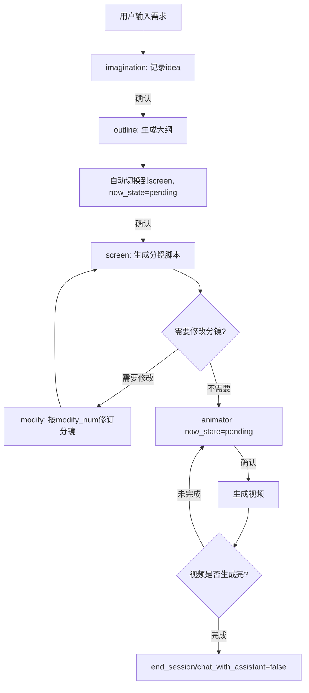
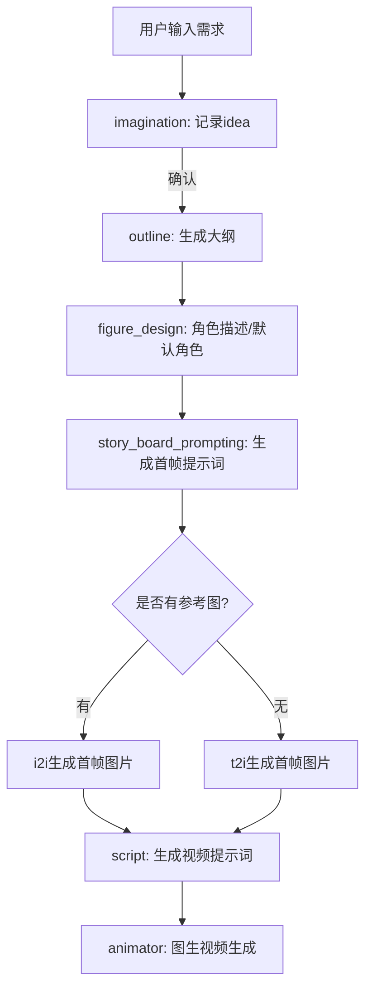
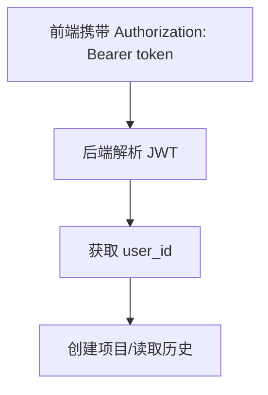

# 核心逻辑

## 状态说明（text2video）
- outline 生成后：`now_task=screen`，`now_state=pending`，等待确认生成分镜脚本。
- screen 生成后：`now_state=modify_comfirm`，仅此阶段弹出修改确认。
- animator 生成后：`now_state=pending`，点击确认继续生成下一段视频。
- 当 `video_generating >= len(screen)` 时，设置 `chat_with_assistant=false` 并结束会话。

## 图生视频流程（image2video）

## 项目接口鉴权

